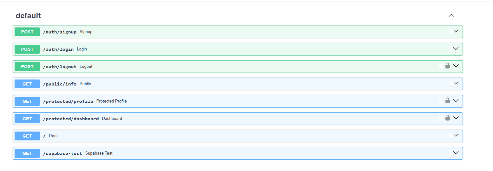

# FlyRank Supabase Auth API

A FastAPI service that demonstrates email-and-password authentication with Supabase. It provides registration and login endpoints, verifies Supabase JWT access tokens for protected routes, supports logout, and exposes its contract through Swagger UI.

## Features

- Supabase-backed email/password sign-up and login
- Bearer-token verification for protected endpoints
- Reusable FastAPI dependency for authorization
- Swagger/OpenAPI bearer authentication support
- Public and protected example routes

## Prerequisites

- Python 3.10 or later
- A Supabase project with Email authentication enabled

## Local setup

Create and activate a virtual environment:

```powershell
python -m venv venv
.\venv\Scripts\Activate.ps1
```

Install the dependencies:

```powershell
pip install -r requirements.txt
```

Create a `.env` file in the project root. Obtain the URL and publishable (anon) key from **Supabase Dashboard → Project Settings → API**.

```dotenv
SUPABASE_URL=https://your-project-ref.supabase.co
SUPABASE_KEY=your-supabase-publishable-or-anon-key
```

`.env` is intentionally ignored by Git. Do not commit real Supabase keys.

## Run the API

```powershell
uvicorn app.main:app --reload
```

The API starts at [http://127.0.0.1:8000](http://127.0.0.1:8000). Open [http://127.0.0.1:8000/docs](http://127.0.0.1:8000/docs) for Swagger UI.

To use a different port, pass it to Uvicorn:

```powershell
uvicorn app.main:app --reload --port 3000
```

## Authentication flow

1. Register with `POST /auth/signup`.
2. Log in with `POST /auth/login` and save the returned `access_token`.
3. Send that token on protected endpoints:

   ```http
   Authorization: Bearer <access_token>
   ```

4. In Swagger UI, select **Authorize**, paste the access token, and run a protected operation.

> The `refresh_token` is not valid as a Bearer token. Use `access_token` for API requests.

## API reference

| Method | Endpoint | Authentication | Description |
| --- | --- | --- | --- |
| `GET` | `/` | No | Service health/welcome message. |
| `GET` | `/public/info` | No | Returns the public information message. |
| `POST` | `/auth/signup` | No | Creates a Supabase user from `email` and `password`. |
| `POST` | `/auth/login` | No | Authenticates credentials and returns access and refresh tokens. |
| `POST` | `/auth/logout` | Yes — Bearer token | Revokes the authenticated session and returns `204 No Content`. |
| `GET` | `/protected/profile` | Yes — Bearer token | Returns the authenticated user's ID, email, and creation time. |
| `GET` | `/protected/dashboard` | Yes — Bearer token | Returns a protected dashboard greeting and user ID. |
| `GET` | `/supabase-test` | No | Development diagnostic for the SDK's current server-side session. |

### Example login request

```bash
curl -X POST http://127.0.0.1:8000/auth/login \
  -H "Content-Type: application/json" \
  -d '{"email":"you@example.com","password":"your-password"}'
```

### Example protected request

```bash
curl http://127.0.0.1:8000/protected/profile \
  -H "Authorization: Bearer <access_token>"
```

## Swagger UI

Protected operations display a lock icon and use the HTTP Bearer security scheme. The screenshot below reflects the available routes.


